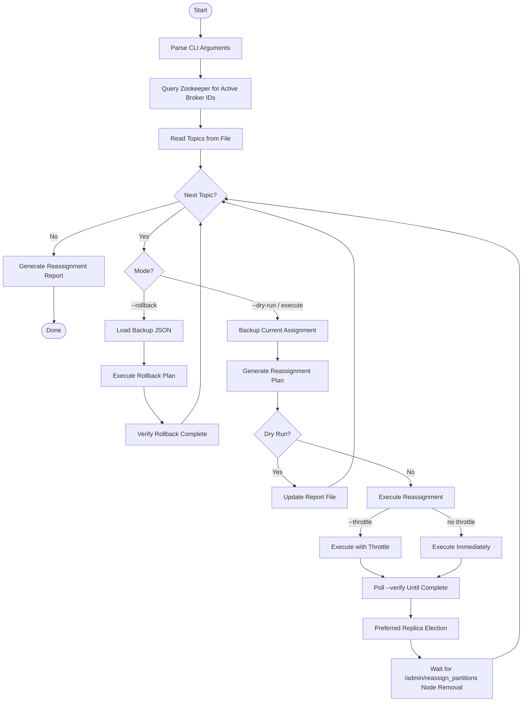

# Kafka Partition Rebalance Toolkit

Shell scripts for rebalancing Kafka topic partitions across active brokers in a cluster. Generates reassignment plans, executes them with optional throttling, and supports rollback via automatic backup of the current assignment.

## Features

- **Partition Reassignment**: Spreads topic partitions evenly across all active brokers without changing replication factor
- **Dry-Run Mode**: Generate and review reassignment plans before executing
- **Rollback Support**: Automatic backup of current assignments with one-command rollback
- **Throttle Control**: Rate-limit data transfer during reassignment to reduce cluster impact
- **Reassignment Report**: Tabular report showing previous and new broker assignments per partition
- **Leader Verification**: Companion script to check leader and ISR placement for a specific broker
- **Preferred Replica Election**: Automatically triggers preferred replica election after reassignment completes

## Prerequisites

- Kafka CLI tools installed at `/usr/local/kafka/`
- `jq` for JSON parsing
- `zookeepercli` for monitoring reassignment progress
- Network access to Zookeeper ensemble
- Bash 4+

## Files

| File | Description |
|------|-------------|
| `kafka-rebalance.sh` | Main rebalance script (generate, execute, rollback) |
| `check_leader.sh` | Verify broker leadership and ISR membership for topics |
| `topics.txt` | Input file listing topics to rebalance (one per line) |

## Usage

### Rebalance Partitions

```bash
# Dry run - generate plan and report without executing
./kafka-rebalance.sh <ZOOKEEPER> topics.txt --dry-run

# Execute reassignment
./kafka-rebalance.sh <ZOOKEEPER> topics.txt

# Execute with throttle (bytes/sec) to limit replication traffic
./kafka-rebalance.sh <ZOOKEEPER> topics.txt --throttle 50000000

# Rollback to previous assignment
./kafka-rebalance.sh <ZOOKEEPER> topics.txt --rollback
```

### Arguments

| Argument | Required | Description |
|----------|----------|-------------|
| `<ZOOKEEPER>` | Yes | Zookeeper hostname or IP address |
| `<TOPICS_FILE>` | Yes | File containing topic names (one per line) |

### Options

| Option | Description |
|--------|-------------|
| `--dry-run` | Generate reassignment plan and report without executing |
| `--rollback` | Restore previous partition assignment from backup |
| `--throttle <RATE>` | Throttle data transfer rate in bytes/sec during reassignment |
| `--help` | Display usage information |

### Check Leader Placement

Verify which partitions have a specific broker as leader or in the ISR:

```bash
./check_leader.sh
```

Edit the script to configure:
- `ZOOKEEPER_HOST` - Target Zookeeper address
- `BROKER_ID` - Broker ID to check
- Topic grep pattern for filtering

## How It Works



### Steps

1. **Discovery**: Queries Zookeeper for the list of active broker IDs
2. **Backup**: Saves the current partition assignment to `backup_reassignment_plan/`
3. **Plan Generation**: Uses `kafka-reassign-partitions.sh --generate` to create a balanced plan
4. **Execution**: Applies the reassignment plan (with optional throttle)
5. **Verification**: Polls until reassignment completes via `--verify` and Zookeeper node check
6. **Preferred Election**: Triggers preferred replica election to align leaders with the new assignment
7. **Report**: Outputs a formatted table of all partition moves to `reassignment_report.txt`

## Output Files

| File | Location | Description |
|------|----------|-------------|
| `reassignment_report.txt` | Current directory | Tabular report of all partition reassignments |
| `backup_reassignment_plan/` | Current directory | Per-topic backup JSON files for rollback |
| `<topic>.reassign.json` | Temp directory | Generated reassignment plan (per topic) |

## Topics File Format

```text
# Comments start with hash
# One topic per line
example.topic
example.device_events
```

## Example

```bash
# Preview what would change
./kafka-rebalance.sh zookeeper.example.com topics.txt --dry-run

# Execute with 50 MB/s throttle
./kafka-rebalance.sh zookeeper.example.com topics.txt --throttle 50000000

# If something goes wrong, rollback
./kafka-rebalance.sh zookeeper.example.com topics.txt --rollback
```

## Report Format

After execution (or dry-run), `reassignment_report.txt` contains:

```
+---------------------------------------------------------+-----------------+------------------+-----------------+
| Topic                                                   | Partition       | Previous Brokers | New Brokers     |
+---------------------------------------------------------+-----------------+------------------+-----------------+
| example.topic                                           | 0               | 101,102,103      | 104,105,106     |
| example.topic                                           | 1               | 102,103,104      | 105,106,107     |
+---------------------------------------------------------+-----------------+------------------+-----------------+
```

## Rollback

The script automatically backs up the current partition assignment before executing any reassignment. Backup files are stored in `backup_reassignment_plan/<topic>.backup.json`.

### How Rollback Works

1. During a normal execution (or `--dry-run`), the script captures the current assignment and saves it to `backup_reassignment_plan/<topic>.backup.json`
2. When you pass `--rollback`, the script reads the backup JSON for each topic in your topics file and re-executes the original assignment
3. It verifies the rollback completes before moving to the next topic

### Running a Rollback

```bash
# Rollback all topics listed in topics.txt to their previous assignment
./kafka-rebalance.sh <ZOOKEEPER> topics.txt --rollback
```

### Requirements

- The `backup_reassignment_plan/` directory must exist in the working directory where you originally ran the script
- Each topic in your topics file must have a corresponding `<topic>.backup.json` file
- If a backup file is missing for a topic, that topic is skipped with a warning

### Manual Rollback (without --rollback flag)

If you need to manually apply a backup file outside of the script:

```bash
/usr/local/kafka/bin/kafka-reassign-partitions.sh \
  --zookeeper <ZOOKEEPER> \
  --reassignment-json-file backup_reassignment_plan/<topic>.backup.json \
  --execute
```

Verify completion:

```bash
/usr/local/kafka/bin/kafka-reassign-partitions.sh \
  --zookeeper <ZOOKEEPER> \
  --reassignment-json-file backup_reassignment_plan/<topic>.backup.json \
  --verify
```

## Safety Considerations

- Always run `--dry-run` first to review the plan before executing
- Use `--throttle` in production to avoid saturating inter-broker network bandwidth
- Backup files are preserved in `backup_reassignment_plan/` for rollback
- Do not delete `backup_reassignment_plan/` until you have confirmed the new assignment is stable
- The script traps SIGINT/SIGTERM for graceful exit during execution
- Reassignment progress is monitored via Zookeeper node `/admin/reassign_partitions`

## Troubleshooting

### Reassignment stuck or slow

Increase the throttle rate or check broker disk I/O:
```bash
# Check reassignment status
/usr/local/kafka/bin/kafka-reassign-partitions.sh \
  --zookeeper <ZOOKEEPER> \
  --reassignment-json-file <JSON_FILE> \
  --verify
```

### Backup file not created

Verify the topic exists and Zookeeper is reachable:
```bash
/usr/local/kafka/bin/kafka-topics.sh --zookeeper <ZOOKEEPER> --describe --topic <TOPIC>
```

### Rollback fails

Confirm backup JSON exists in `backup_reassignment_plan/<topic>.backup.json`. If missing, the original assignment was not captured before execution.
